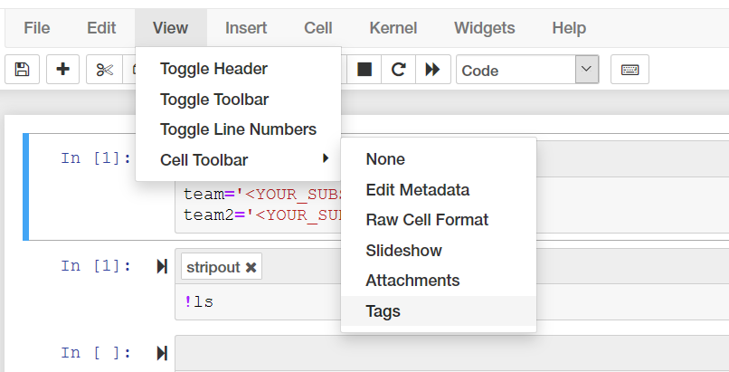
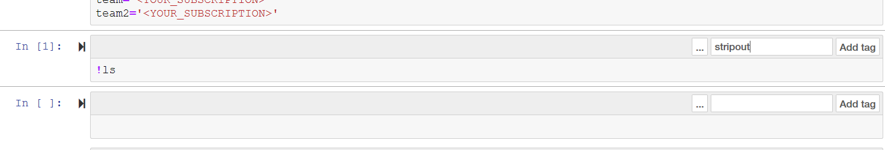

# Introduction 
This app offers methods to run on notebooks to ensure no sensitive information is contained in the cell or sensitive 
output is removed.

It is built using Python Fire so the interface is a little peculiar >:)

# Installation
To install you can simply run the following
```bash
pip install git+https://github.com/msalvaris/nbtoolz.git
```

It has been tested on Ubuntu but should run on Windows. 

# How to Use
The app offer 4 methods, 2 that alter the context and 2 that are used as the final output. *strip_output* and *replace* 
alter the contents of the notebook. *print* prints the output of the processing to the terminal and *write*  
writes the result of the transformations to the file specified.

In the example below we will strip out cells tagged with strip_out tag and replace Team B with <YOUR_TEAM> and print 
out the results to the terminal.
```bash
nbtoolz test.ipynb strip_output strip_out replace "Team B" "<YOUR_TEAM>" print
```

The default tag for strip_output is strip_out so the following does the same.
```bash
nbtoolz test.ipynb strip_output - replace "Team B" "<YOUR_TEAM>" print
```

To tag a cell simply select tags in the cell output menu   


and add the tag in the text box above the cell  


We can also chain more methods
```bash
nbtoolz test.ipynb strip_output - replace "Team B" "<YOUR_TEAM>" replace "TEAM A" "<YOUR_TEAM>" print
```

To write the output to the file simply run write at the end
```bash
nbtoolz test.ipynb strip_output - replace "Team B" "<YOUR_TEAM>" replace "TEAM A" "<YOUR_TEAM>" write out.ipynb
```

It also accepts a list of files
```bash
nbtoolz test.ipynb test2.iynb strip_output - replace "Team B" "<YOUR_TEAM>" replace "TEAM A" "<YOUR_TEAM>" write out.ipynb out2.ipynb
```

or wildcards
```bash
nbtoolz *.ipynb strip_output - replace "Team B" "<YOUR_TEAM>" replace "TEAM A" "<YOUR_TEAM>" write
```

# Configure git filter
You can configure git filter to use nbtoolz to ensure that you never commit any sensitive information. To do so once you
have installed nbtoolz

Simply create a shell script called nbfilter that accepts a single argument and add it to your path or .bashrc
```bash
#!/usr/bin/env bash

nbtoolz  ${1} - strip_output - replace "Team" "<YOUR_SUBSCRIPTION>" replace "Team2" "<YOUR_SUBSCRIPTION>" print

```

Then you can either edit the .git/config file and add the following
```text
[filter "nbclean"]
    clean = /home/mat/repos/nbtoolz/nbfilter
    smudge = cat
```

or run the following commands

```bash
git config filter.nbclean.clean nbfilter
git config filter.nbclean.smudge cat
```

then create a .gitattributes file in your project directory and add the following
```text
*.ipynb filter=nbclean
```


# Contribute
Please post issues, PRs welcome :)

